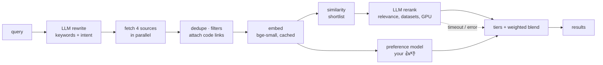

# Research Copilot

[](https://github.com/tryzhaa/Research-Copilot/actions/workflows/ci.yml)

Finds research papers across arXiv, OpenAlex, Hugging Face Papers and Semantic Scholar, and
ranks them for one person: their standing interests, their past 👍/👎, and whether the paper
has code, named datasets and a CPU-sized compute budget. Summaries follow a template that ends
in a concrete build plan.

It is also a small ranking system with an evaluation harness. Every search is recorded, your
ratings label it, and `eval.run_eval` measures, on those labels, whether each stage of the
pipeline actually puts the papers you like first.

## Pipeline



1. **Retrieve.** An LLM first rewrites the query into 1-5 source keywords (abbreviations expanded,
   filler dropped) and a sentence of intent that drives similarity and ranking. Four sources are
   queried concurrently with the keywords, merged across arXiv IDs, DOIs and titles,
   and hard-filtered (year, keywords, citations). Code links come from the live Hugging Face
   Papers API and a local SQLite index of the Papers with Code archive.
2. **Embed.** Title + abstract go through `BAAI/bge-small-en-v1.5` (fastembed/ONNX, CPU). Vectors
   are cached in SQLite by paper and text hash, so repeat searches only embed what's new.
3. **Shortlist.** Cosine similarity to the query plus the user's interests picks which candidates
   the LLM reads.
4. **Rerank.** An LLM scores the shortlist for relevance, extracts named datasets and judges GPU
   need. Hosted open models (Groq, Cerebras, Gemini, OpenRouter) take a few seconds; local
   Ollama and Claude are also supported.
5. **Blend.** Among papers relevant enough (`min_relevance`), hard tiers (datasets, code, CPU by
   default) come first, then a configurable weighted mean of the signals each paper has. When the LLM times out or fails, its signals drop out and results
   fall back to similarity instead of arriving unranked.

## Evaluation

```
python -m eval.dataset     # join saved searches with your ratings → eval/dataset.json
python -m eval.run_eval    # compare strategies; appends to eval/results.csv with the git commit
```

Each labeled search is replayed under every strategy (random, source order, recency, citations,
similarity only, LLM only, the original hand-tuned heuristic, the current pipeline, the
preference model, and pipeline + preference), scored with P@5, P@10, NDCG@10 and MRR, and
averaged over searches with standard errors. The replay uses the scores recorded at search time,
so it needs no API keys and runs in CI on every push.

Design choices that keep the numbers honest:

- **Leakage.** The LLM is shown your recent liked/disliked titles. Any candidate whose label it saw
  during a search is dropped from that search's evaluation pool.
- **Selection bias.** You mostly rate what the ranker showed you, which would grade every strategy
  on the current one's top 10. Each search also offers 5 random unshown candidates for rating.
- **Out-of-fold preference scores.** For each search, the preference model is retrained without
  that search's labels before scoring it.
- **Condensed lists.** Most candidates are never rated, so metrics are computed over the rated
  ones only, the standard treatment for incomplete judgments.

**Results: not yet available.** The harness needs labeled searches. With roughly 100 ratings
across 10+ searches, the table in `eval/results.csv` becomes worth reading. The metric code is
tested against hand-computed values, and a synthetic end-to-end test checks that each strategy
ranks where it was constructed to.

## The preference model

A logistic regression on frozen embeddings, trained on your ratings
(`python -m scripts.train_preference_model`, which reports stratified k-fold ROC-AUC first).
With tens to low hundreds of labels, a 384-weight linear probe is about the capacity the data
supports; fine-tuning the 33M-parameter embedding model on the same labels would mostly
memorize them. It enters the blend at `weights.preference: 0` until the evaluation shows it helps.

## Engineering

- `mypy` with `disallow_untyped_defs`, 66 `pytest` tests (78% coverage of `copilot/`),
  mocked HTTP for every source and the LLM client.
- Typed errors (`SourceFetchError`, `RankingTimeoutError`, ...) reach the UI per source:
  which source failed and why (timeout, rate limit, network).
- Sources retry 429/5xx with backoff; hosted LLMs wait out one short rate limit.
- CI: type check → tests with coverage → evaluation report as a run summary and artifact.
- Local ranking went from 14.5 to 6 minutes per search by batching; hosted models bring it to
  seconds.

## Run it

```
python -m venv .venv && .venv/bin/pip install -r requirements-dev.txt
echo "GROQ_API_KEY=..." > .env          # or set provider: ollama in preferences.yaml
.venv/bin/uvicorn app:app --reload      # http://localhost:8000
.venv/bin/pytest
```

Everything that shapes ranking lives in `preferences.yaml` and is re-read on every request:
provider and model, fields, filters, interests, tiers, blend weights, and how many papers are
fetched, reranked and shown.
