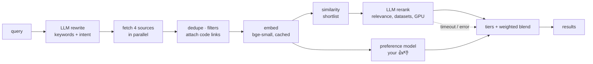

# Research Copilot

[](https://github.com/tryzhaa/Research-Copilot/actions/workflows/ci.yml)

Finds research papers across arXiv, OpenAlex, Hugging Face Papers and Semantic Scholar, and
ranks them for one person: their standing interests, their past 👍/👎, and whether the paper
has code, named datasets and a CPU-sized compute budget. Summaries follow a template that ends
in a concrete build plan.

It is also a small ranking system with an evaluation harness. Every search is recorded, your
ratings label it, and `eval.run_eval` measures, on those labels, whether each stage of the
pipeline actually puts the papers you like first.

## Pipeline



1. **Retrieve.** An LLM first rewrites the query into 1-5 source keywords (abbreviations expanded,
   filler dropped) and a sentence of intent that drives similarity and ranking. Four sources are
   queried concurrently with the keywords, merged across arXiv IDs, DOIs and titles,
   and hard-filtered (year, keywords, citations). Code links come from the live Hugging Face
   Papers API and a local SQLite index of the Papers with Code archive.
2. **Embed.** Title + abstract go through `BAAI/bge-small-en-v1.5` (fastembed/ONNX, CPU). Vectors
   are cached in SQLite by paper and text hash, so repeat searches only embed what's new.
3. **Shortlist.** Cosine similarity to the query plus the user's interests picks which candidates
   the LLM reads.
4. **Rerank.** An LLM scores the shortlist for relevance, extracts named datasets and judges GPU
   need. Hosted open models (Groq, Cerebras, Gemini, OpenRouter) take a few seconds; local
   Ollama and Claude are also supported.
5. **Blend.** Among papers relevant enough (`min_relevance`), hard tiers (datasets, code, CPU by
   default) come first, then a configurable weighted mean of the signals each paper has. When the LLM times out or fails, its signals drop out and results
   fall back to similarity instead of arriving unranked.

## Similarity graph

Every paper you've come across (all saved searches plus your library) is linked to its 8 nearest
neighbours by embedding similarity. **similar** on any paper runs a personalized PageRank walk
from it: you get its closest papers, plus papers reached through the graph that plain
nearest-neighbour search misses, each labelled with the paper that links them. The **map** tab
draws the graph around what's on screen and in your library, so topic clusters are visible.

## Evaluation

```
python -m eval.dataset     # join saved searches with your ratings → eval/dataset.json
python -m eval.run_eval    # compare strategies; appends to eval/results.csv with the git commit
```

Each labeled search is replayed under every strategy (random, source order, recency, citations,
similarity only, LLM only, the original hand-tuned heuristic, the current pipeline, the
preference model, and pipeline + preference), scored with P@5, P@10, NDCG@10 and MRR, and
averaged over searches with standard errors. The replay uses the scores recorded at search time,
so it needs no API keys and runs in CI on every push.

Design choices that keep the numbers honest:

- **Leakage.** The LLM is shown your recent liked/disliked titles. Any candidate whose label it saw
  during a search is dropped from that search's evaluation pool.
- **Selection bias.** You mostly rate what the ranker showed you, which would grade every strategy
  on the current one's top 10. Each search also offers 5 random unshown candidates for rating.
- **Out-of-fold preference scores.** For each search, the preference model is retrained without
  that search's labels before scoring it.
- **Condensed lists.** Most candidates are never rated, so metrics are computed over the rated
  ones only, the standard treatment for incomplete judgments.

### Results so far

56 ratings (26 liked, 30 disliked) over 11 searches, after dropping 14 labels the LLM had seen.
Mean ± standard error across searches:

| Strategy | P@5 | NDCG@10 | MRR |
|---|---|---|---|
| random | 0.43 ± 0.05 | 0.86 ± 0.05 | 0.83 ± 0.06 |
| recency | 0.47 ± 0.04 | 0.89 ± 0.04 | 0.86 ± 0.07 |
| citations | 0.40 ± 0.06 | 0.84 ± 0.07 | 0.79 ± 0.11 |
| similarity only | 0.38 ± 0.08 | 0.84 ± 0.08 | 0.78 ± 0.11 |
| LLM relevance only | **0.49 ± 0.05** | 0.92 ± 0.04 | 0.89 ± 0.07 |
| original heuristic (tiers + 50/50 LLM) | 0.47 ± 0.08 | **0.94 ± 0.05** | **0.92 ± 0.08** |
| current pipeline (similarity + LLM) | 0.45 ± 0.07 | 0.92 ± 0.06 | **0.92 ± 0.08** |
| preference model only | 0.47 ± 0.04 | 0.91 ± 0.05 | 0.89 ± 0.08 |
| current pipeline + preference (0.15) | 0.45 ± 0.07 | 0.92 ± 0.06 | **0.92 ± 0.08** |

What this does and doesn't show:

- **The LLM carries the ranking.** The four strategies that use its scores lead on NDCG and
  MRR, but their gaps to random are one to two standard errors: with 11 searches this is a
  direction, not a result.
- **Embedding similarity alone is no better than random** (worse on every metric). Similarity
  to the query plus stated interests doesn't capture what gets liked, so it now only chooses
  which candidates the LLM reads, and the pipeline built on it doesn't beat the original
  hand-tuned heuristic.
- **The preference model isn't useful yet**: cross-validated ROC-AUC 0.59 ± 0.15 (5 folds,
  0.5 is chance), and at weight 0.15 it changed no ranked list. It stays at weight 0.
- P@10 (in `eval/results.csv`) is ~0.29-0.30 for every strategy: each search has only about
  five rated candidates, so any top 10 contains nearly all of them, and order can't matter.

The next step is more labels, especially on the random unshown candidates, before tuning
anything against these numbers. The metric code is tested against hand-computed values, and a
synthetic end-to-end test checks that each strategy ranks where it was constructed to.

## The preference model

A logistic regression on frozen embeddings, trained on your ratings
(`python -m scripts.train_preference_model`, which reports stratified k-fold ROC-AUC first).
With tens to low hundreds of labels, a 384-weight linear probe is about the capacity the data
supports; fine-tuning the 33M-parameter embedding model on the same labels would mostly
memorize them (an assumption, not yet measured here). It enters the blend at
`weights.preference: 0` until the evaluation shows it helps, which it doesn't yet (above).

## Engineering

- `mypy` with `disallow_untyped_defs` and the pydantic plugin; 83 `pytest` tests,
  mocked HTTP for every source and the LLM client.
- `Paper` is a pydantic model, validated wherever a paper enters: sources, the browser
  (a malformed paper gets a 422 naming the bad field), `library.json` and the eval dataset.
- Typed errors (`SourceFetchError`, `RankingTimeoutError`, ...) reach the UI per source:
  which source failed and why (timeout, rate limit, network).
- Sources retry 429/5xx with backoff; hosted LLMs wait out one short rate limit.
- CI: type check → tests with coverage → evaluation report as a run summary and artifact.
- Local ranking went from 14.5 to 6 minutes per search by batching; hosted models bring it to
  seconds.

## Run it

```
python -m venv .venv && .venv/bin/pip install -r requirements-dev.txt
echo "GROQ_API_KEY=..." > .env          # or set provider: ollama in preferences.yaml
.venv/bin/uvicorn app:app --reload      # http://localhost:8000
.venv/bin/pytest
```

Everything that shapes ranking lives in `preferences.yaml` and is re-read on every request:
provider and model, fields, filters, interests, tiers, blend weights, and how many papers are
fetched, reranked and shown.

## Deploy

The `Dockerfile` builds a public demo image: the Papers with Code index and the embedding model
are baked in, and it runs with `DEMO_MODE=1`:

- **Read-only.** Rating, saving, folders and removing return 403 and are hidden: one process
  serves every visitor, so writes would leak between strangers and steer each other's rankings.
  `library.json`, `.env` and `data/` never enter the image (`.dockerignore`, `.gcloudignore`).
- **Rate-limited.** Each visitor gets `DEMO_SEARCHES_PER_HOUR` searches (default 5) and
  `DEMO_SUMMARIES_PER_HOUR` summaries (5); all visitors share `DEMO_DAILY_LIMIT` model calls a
  day (150), which keeps a free Groq key inside its quota. Counts live in memory, so they reset
  when the instance restarts.

Locally: `docker build -t research-copilot . && docker run -p 7860:7860 --env-file .env research-copilot`.
Measured in a container limited to 1 GB and 1 CPU: 650-780 MB at peak, a 5 s start, and ~40 s
per three-field search. Fetching is capped by `source_timeout_seconds` (25 s; OpenAlex alone can
take 10-50 s per query), and most of the rest is embedding ~100 candidates on one CPU.

### Google Cloud Run

Scales to zero, so an idle demo costs nothing; the first visit after a quiet spell waits for a
cold start. Needs the [gcloud CLI](https://cloud.google.com/sdk/docs/install) and a project with billing
enabled (set a budget alert under Billing → Budgets).

```
gcloud auth login
gcloud config set project <project-id>
gcloud services enable run.googleapis.com cloudbuild.googleapis.com \
    artifactregistry.googleapis.com secretmanager.googleapis.com

# API keys go in Secret Manager, never in the image
printf %s "<groq key>" | gcloud secrets create groq-api-key --data-file=-
printf %s "<openalex key>" | gcloud secrets create openalex-api-key --data-file=-
SA="$(gcloud projects describe "$(gcloud config get-value project)" --format='value(projectNumber)')-compute@developer.gserviceaccount.com"
for s in groq-api-key openalex-api-key; do
  gcloud secrets add-iam-policy-binding $s --member="serviceAccount:$SA" --role=roles/secretmanager.secretAccessor
done

# Builds the Dockerfile in Cloud Build, then deploys
gcloud run deploy research-copilot --source . --region us-central1 --allow-unauthenticated \
    --memory 1Gi --cpu 1 --cpu-boost --min-instances 0 --max-instances 1 \
    --set-secrets GROQ_API_KEY=groq-api-key:latest,OPENALEX_API_KEY=openalex-api-key:latest
```

`--max-instances 1` keeps the demo's rate limits in one place and caps spend. Redeploy after a
change by re-running the last command.
